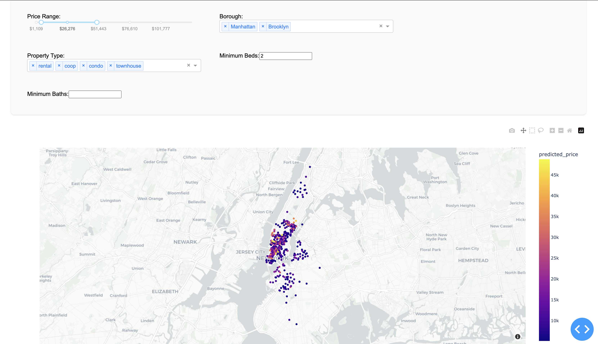
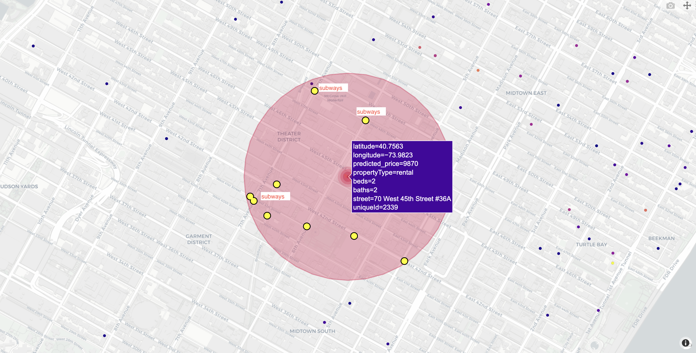
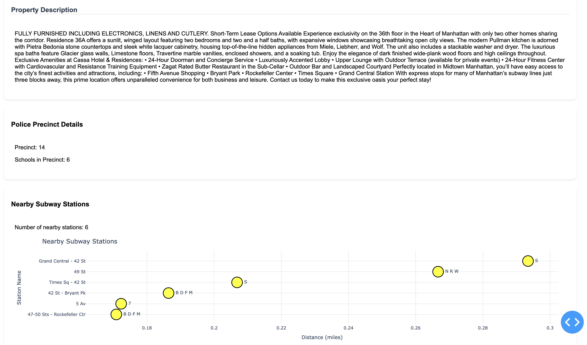
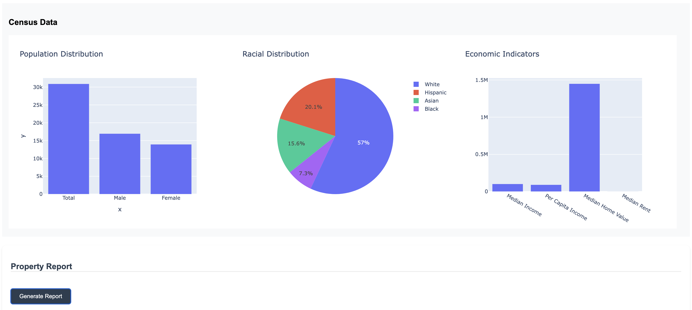

# NYC Rental Market Analysis Project

This project analyzes the NYC rental market by combining data from multiple sources including Zillow, StreetEasy, census data, and various external datasets to create a comprehensive analysis and visualization platform.

Click the [link](https://youtu.be/3oJAN6OTuDc) for demo

## Setup Instructions

**1. Create and Activate Virtual Environment**

For Windows:
```bash
python -m venv venv
venv\Scripts\activate
```

For macOS/Linux:
```bash
python -m venv venv
source venv/bin/activate
```

**2. Install Dependencies**
```bash
pip install -r requirements.txt
```

**3. Run Visualization Dashboard**
```bash
python rental_visualise/visualize.py
```

## Project Structure

**Data Collection**
- `zillow_scraper/`: Scripts for scraping Zillow rental data (outputs: rent_data_zillow.csv)
- `streetezy_scraper/`: Scripts for scraping StreetEasy rental data (outputs: streeteasy_rentals.csv)
- `census_data/`: Scripts to fetch NYC census data by pincode using API (outputs: census_data.csv)
- `external_data/`: Contains police precinct data, school data, and subway location data

**Data Processing**
- `merger.ipynb`: Combines scraped data with external datasets and performs initial feature engineering (outputs: final_rental_merged.csv)
- `final_data_cleaning/`: Scripts for data cleaning and preparation for visualization (outputs: final_cleaned_data.csv)
- `midtern_anaysis/`: Progress report and interim analysis files

**Analysis & Visualization**
- `llm-report/`: Code for generating automated property reports
- `rental_visualise/`: Dashboard and UI implementation files
- `screenshots/`: Project screenshots and visual documentation

**Modeling**
- `final_modelling/`:
  - `EDA.ipynb`: Exploratory Data Analysis
  - `feature_engineering.ipynb`: Feature creation and transformation
  - `modelling_copy2.ipynb`: Final model implementation
  - `comparitive_analysis.ipynb`: Model comparison and selection

## Data Flow

1. Data is collected from multiple sources:
   - Zillow and StreetEasy scrapers
   - Census API
   - External datasets (police, schools, subway)

2. `merger.ipynb` combines all datasets:
   - Handles large crime data during runtime
   - Performs initial feature engineering
   - Outputs: final_rental_merged.csv

3. Final cleaning and processing:
   - Prepares data for visualization and analysis
   - Creates final_cleaned_data.csv

## Dashboard Features

- Interactive rental market visualization
- Property report generation using LLM
- Market analysis tools
- Comparative property insights

## Screenshots

- **Property Filters**  
    
  The dashboard interface with options to filter properties based on various criteria.

- **Details for Selected Property on Map**  
    
  Displays detailed information when a property is selected on the interactive map.

- **Property Description**  
    
  Detailed view showing individual property attributes and rental insights.

- **Census Details for Selected Zip Code**  
    
  Provides demographic and economic census data for the chosen zip code.

- **Property Report Sample**  
  [Property Report](./media/ds_report.pdf)  
  Example of an automated property report generated using LLM.

## Note

Crime data (>700MB) is handled dynamically during the merger process to maintain repository size efficiency. Make sure you are in the project's root directory when executing setup commands.